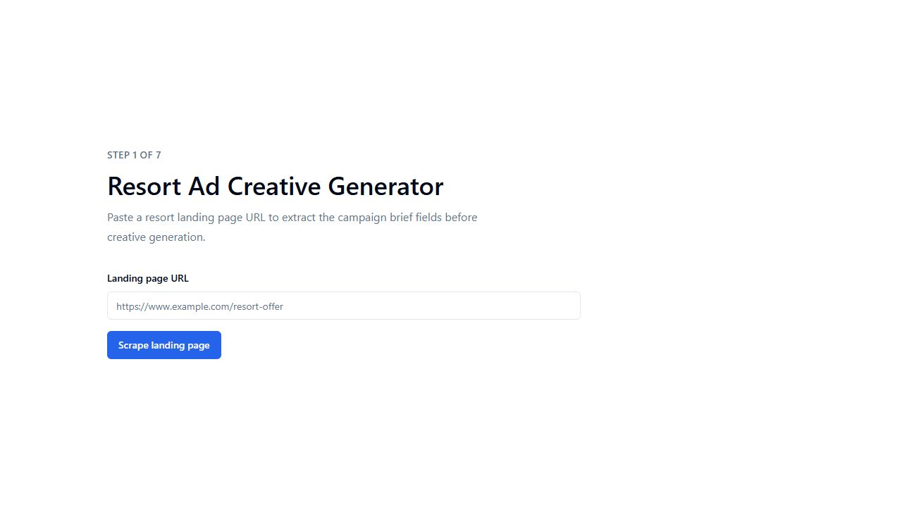
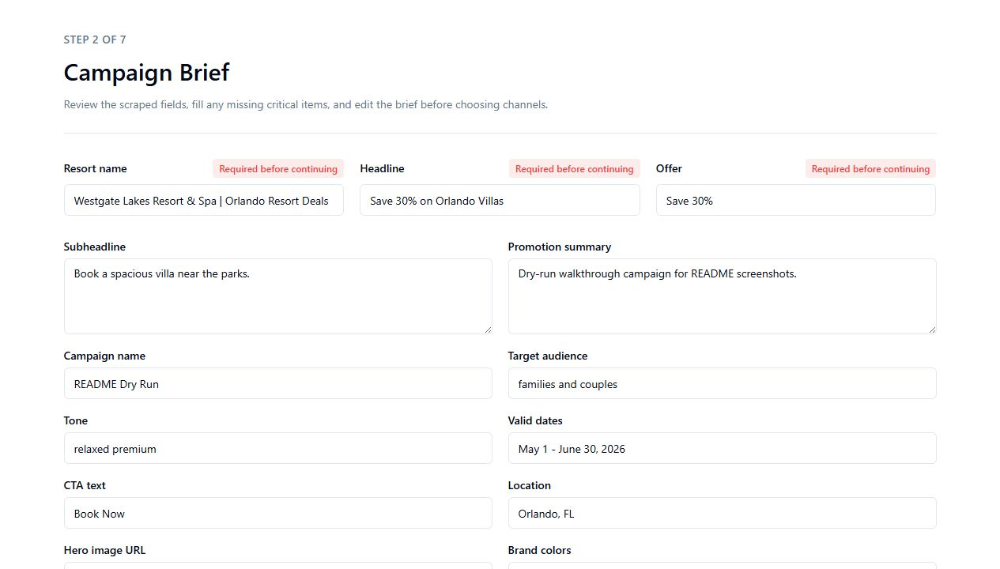
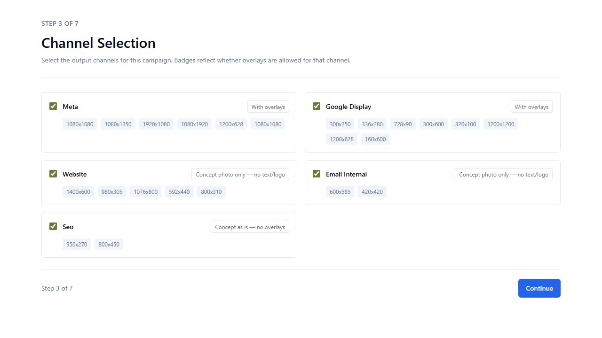
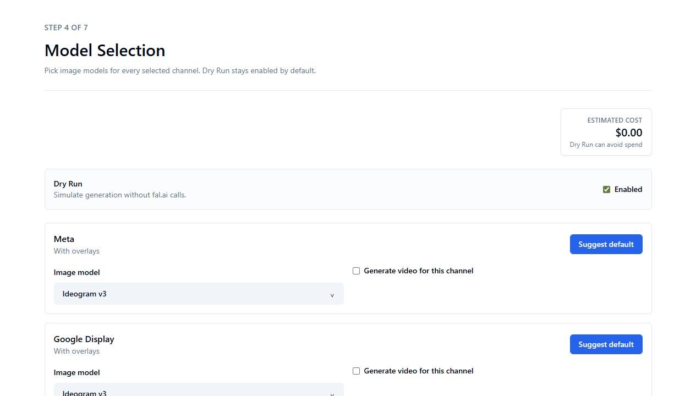
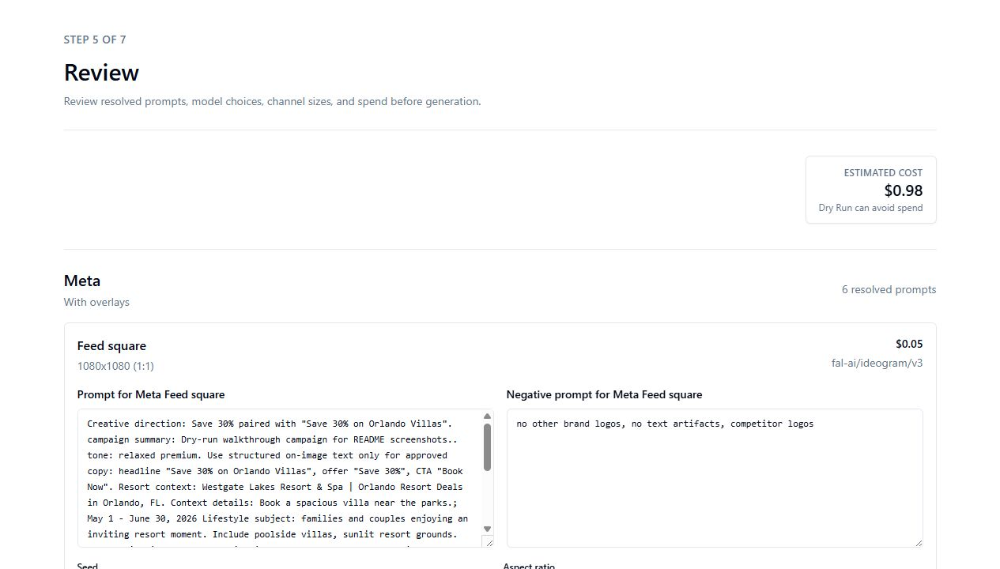
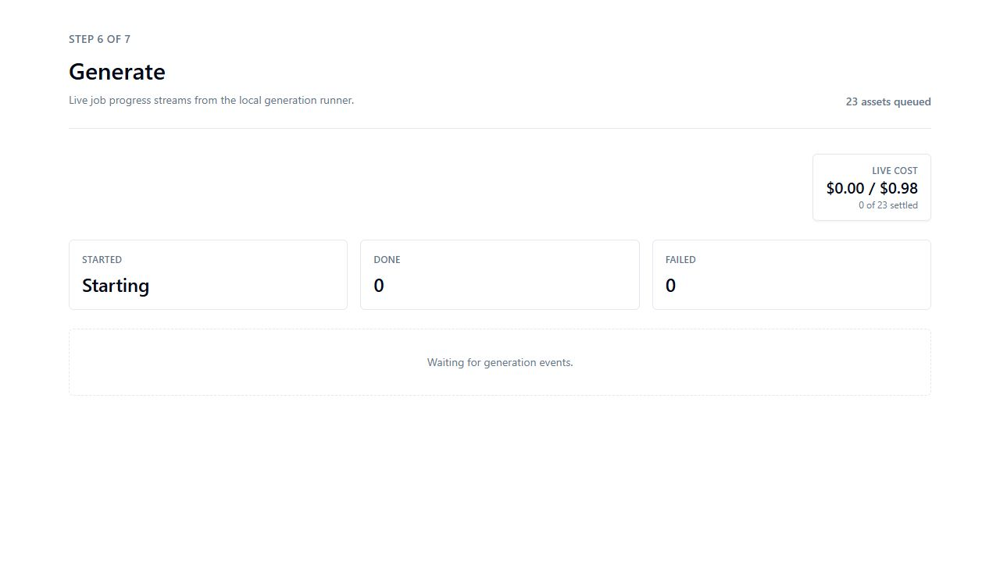
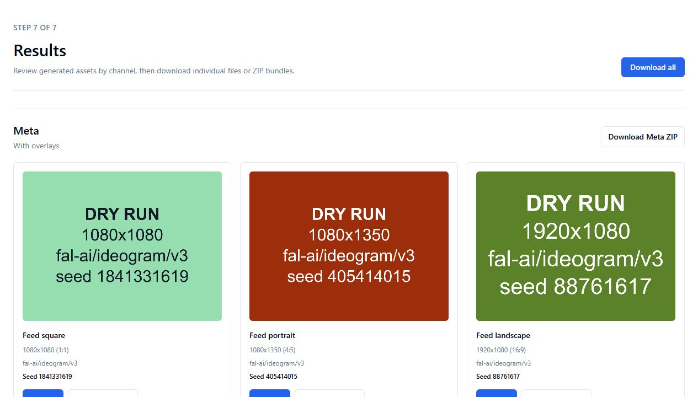

# Resort Ad Creative Generator

A local Next.js web app for producing paid social, display, website, email, and SEO creative assets for resort campaigns. The application is UI-only once started: create or open a project, fill out the wizard in the browser, review prompts and model choices, then generate assets with fal.ai or Dry Run placeholders.

## Screenshots

The screenshots below were captured from a local Dry Run, so they show the full flow without any fal.ai spend.

### Step 1 - Landing Page



### Step 2 - Campaign Brief



### Step 3 - Channel Selection



### Step 4 - Model Selection



### Step 5 - Creative Direction

The Creative Direction step is a chat with the AI Creative Director agent. It asks for missing property/campaign context, proposes creative angles, waits for approval, then generates prompts for Review.

### Step 6 - Review



### Step 7 - Generate



### Step 8 - Results



## Local Setup

```bash
git clone <repo-url>
cd <repo-folder>
npm install
```

Create your local environment file from the example:

```powershell
Copy-Item .env.example .env.local
```

Or, on macOS/Linux:

```bash
cp .env.example .env.local
```

Then edit `.env.local` and add your fal.ai API key:

```bash
FAL_KEY=your_fal_key_here
OPENAI_API_KEY=your_openai_key_here
OPENAI_PROMPT_MODEL=gpt-5.4
```

Start the local app:

```bash
npm run dev
```

Open [http://localhost:3000](http://localhost:3000), create or select a project, then paste the landing page URL on that project's Step 1 page. By default the app binds to localhost only.

## Environment Variables

| Variable | Required | Description |
| --- | --- | --- |
| `FAL_KEY` | Required for live runs | fal.ai API key. It is used server-side only and is not needed for Dry Run mode. |
| `OPENAI_API_KEY` | Optional | Enables the Step 5 Creative Direction chat to use OpenAI. The app does not call it on page load; calls happen only when the user asks the agent, generates angles, or approves an angle. |
| `OPENAI_PROMPT_MODEL` | Optional | OpenAI Responses API model for the Creative Direction agent. Defaults to `gpt-5.4`. |
| `PORT` | Optional | Local server port. Defaults to `3000`. |
| `HOST` | Optional | Defaults to localhost binding. Set `HOST=0.0.0.0` only when you intentionally want LAN access; the dev server prints a warning. |

## Dry Run Mode

Dry Run is available on Step 4, Model Selection, but live generation is the default. Turn Dry Run on manually when testing the UI or development flow. In Dry Run mode the app generates deterministic placeholder images with `sharp`, writes the normal output files, and logs zero-cost entries without calling fal.ai.

Live generation requires `FAL_KEY` in `.env.local`. If the estimate exceeds `$5`, the UI requires an explicit confirmation before continuing.

When `openai/gpt-image-2` is selected, Step 4 shows a `GPT Image 2 quality` control with `auto`, `low`, `medium`, and `high`. The selected value is saved with the run, shown on Review, and sent to fal.ai as the `quality` input.

## Project Mass Edit

Each project has a separate `Mass edit images` tool outside the eight-step wizard. Use it when you already have a batch of images and want to run one or more broad edit instructions, such as removing logos from one group and adding an approved mark to another group.

Inside Mass Edit, add as many edit sections as needed. Each section has its own uploaded images, prompt, image model, and quality setting. The app sends each source image as `image_urls` to compatible fal.ai edit models such as `openai/gpt-image-2/edit`, requests the nearest multiple-of-16 generation size, then writes the final edited image back at the original source dimensions and aspect ratio.

Mass Edit writes outputs under:

```text
outputs/<project-slug>/mass-edits/<runId>/
  request.json
  cost-log.jsonl
  mass-edit-results.json
  raw/<edit-section>/
  drafts/<edit-section>/
  final/<edit-section>/
```

Dry Run is enabled by default for Mass Edit because large batches can spend quickly. Turn it off only when you are ready for a live fal.ai edit run.

## Brief Defaults

Step 2 pre-fills a short campaign name such as `July 4th`, `Memorial Day`, or `Epic Universe` when the landing page contains a recognizable promo theme. Brand colors always use the fixed Westgate palette: Navy Blue `#0e2545`, Gold `#c4a55d`, Orange `#d95d31`, Bright Blue `#3892dc`, and Westgate Blue `#148dd0`.

## Creative Direction

Step 5 adds a chat-based Creative Direction workflow after model selection and before Review. The agent reads `src/generators/resort-ad-creative-prompt-agent.md`, asks for missing campaign/property details, proposes 2-3 creative angles, and waits for the user to approve one. Once approved, the app generates reviewed prompts for every selected channel size and carries them into Review.

If `OPENAI_API_KEY` is missing, the step still works with deterministic fallback questions, angles, and prompt prefixes so the UI can be tested without OpenAI spend.

## Prompt Assignments

Step 6, Review, includes a `Prompt assignments` section. Use it to create one creative direction and assign it to one or more selected channel sizes, such as a Meta-specific social concept and a separate Email/SEO concept. The reviewed prompts are saved before generation, so Dry Run and live runs use the exact prompt package shown on the Review page.

Step 6 also lets you upload reference images for a custom prompt assignment or for an individual resolved prompt. Uploaded references are stored through fal.ai storage and saved as `image_urls` with the reviewed prompt, so compatible models such as `openai/gpt-image-2/edit` can use them during the initial generation. Step 8 re-rolls expose the same controls: edit the prompt, adjust the negative prompt, change the model, and attach reference images before re-running that asset.

The `Creative agent` button on each Step 6 resolved prompt is still available for per-prompt revisions. It reads `src/generators/resort-ad-creative-prompt-agent.md` as its instruction file, sends the current brief/channel/size/model/reference-image context to OpenAI's Responses API, and applies the returned Creative Director prompt back into the editable prompt box. It does not run automatically; review and edit the result before generating.

If a selected model is marked as not supporting a separate negative prompt, the app appends the negative instructions to the positive prompt and sends only the combined prompt to fal.ai.

For overlay channels such as Meta and Google Display, the prompt builder uses a concise direct-response travel-ad template instead of stitching together the full scraped brief. It derives the destination, price, stay duration, and promo badge from the brief, then frames the creative with bold price hierarchy, bright contrast, a 40% image-area rule, and a limited set of exact on-image text elements. Generated prompts intentionally avoid company names, property names, trademarks, and brand marks. No-text channels such as Website, Email Internal, and SEO stay in concept-photo mode and keep the same no-brand rule.

## Model Catalog

The model picker loads fal.ai model metadata through the local API and caches it at:

```text
cache/models-catalog.json
```

The cache refreshes automatically every 24 hours. You can also click `Refresh catalog` on Step 4 to call `POST /api/models/refresh` and bust the cache. If the live catalog fetch fails, the UI falls back to the latest cached copy. If no cache exists, the model picker exposes a manual model-id fallback.

## Outputs

Generated files are written under:

```text
outputs/<project-slug>/<destination-slug>/<campaign-slug>/<runId>/
```

Older runs created before project or destination support may still appear at `outputs/<campaign-slug>/<runId>/` or `outputs/<project-slug>/<campaign-slug>/<runId>/`. Each new project run contains the resolved campaign data, prompts, cost log, raw files, drafts, final assets, OCR log, and a static `contact-sheet.html` archive. Final assets are grouped by channel:

```text
outputs/<project-slug>/<destination-slug>/<campaign-slug>/<runId>/
  raw/
  drafts/
  final/
    meta/
    google_display/
    website/
    email_internal/
    seo/
  cost-log.jsonl
  ocr-log.jsonl
  contact-sheet.html
```

The results page is available at:

```text
http://localhost:3000/results/<runId>
```

Review, Generate, and Results include a `Start over` button that returns to Step 1 for the same project without deleting existing run data or generated outputs.

## Development Checks

Run the required checks before handing off changes:

```bash
npm run typecheck
npm test
```

Useful additional checks:

```bash
npm run build
npm run inspect:fal-key
```

`npm run inspect:fal-key` verifies the built client bundle does not contain `FAL_KEY`.
